# 🧬 Spring Boot - Selenium WebDriver Test Automation Framework

<div align="center">


</div>

<div align="center">

### **Quantum Selenium Test Automation Ecosystem**

**A Scientific Approach to Web Application Validation Using Advanced WebDriver Orchestration**

</div>

> **Note**: This document provides comprehensive guidance on the quantum-level test automation framework, its molecular components, and advanced orchestration patterns for web application validation.

## 📋 Table of Contents
1. [Framework Overview](#-framework-overview)
2. [Architecture & Design](#-architecture--design)
3. [Project Structure](#-project-structure)
4. [Component Architecture](#-component-architecture)
5. [Test Execution Flow](#-test-execution-flow)
6. [Available Test Cases](#-available-test-cases)
7. [Test Management](#-test-management)
8. [Configuration](#-configuration)
9. [Running Tests](#-running-tests)
10. [Test Data Management](#-test-data-management)
11. [Reporting & Analytics](#-reporting--analytics)
12. [Browser Features](#-browser-features)
13. [Code Standards](#-code-standards)
14. [Git Management](#-git-management)
15. [Troubleshooting](#-troubleshooting)

## 🏗️ Framework Overview

This is a robust Selenium WebDriver based test automation framework built with modern technologies:

| Component | Technology | Purpose |
|-----------|------------|---------|
| **Core Framework** | Java 17 | Base programming language |
| **Dependency Injection** | Spring Boot 3.2.0 | Application context and bean management |
| **Testing Framework** | TestNG 7.9.0 | Test execution and reporting |
| **Browser Automation** | Selenium WebDriver 4.16.1 | Web UI automation |
| **Page Objects** | Page Factory | Web element management |
| **Driver Management** | WebDriverManager | Automated browser driver setup |
| **Build Tool** | Maven | Dependency and build management |


## 🏛️ Architecture & Design

### High-Level Architecture

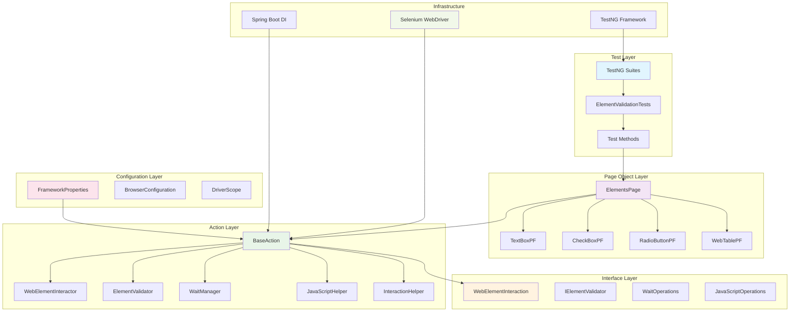
```mermaid
graph TB
    subgraph "Test Layer"
        A[TestNG Suites] --> B[ElementValidationTests]
        B --> C[Test Methods]
    end
    
    subgraph "Page Object Layer"
        D[ElementsPage] --> E[TextBoxPF]
        D --> F[CheckBoxPF]
        D --> G[RadioButtonPF]
        D --> H[WebTablePF]
    end
    
    subgraph "Action Layer"
        I[BaseAction] --> J[WebElementInteractor]
        I --> K[ElementValidator]
        I --> L[WaitManager]
        I --> M[JavaScriptHelper]
        I --> N[InteractionHelper]
    end
    
    subgraph "Interface Layer"
        O[WebElementInteraction]
        P[IElementValidator]
        Q[WaitOperations]
        R[JavaScriptOperations]
    end
    
    subgraph "Configuration Layer"
        S[FrameworkProperties]
        T[BrowserConfiguration]
        U[DriverScope]
    end
    
    subgraph "Infrastructure"
        V[Selenium WebDriver]
        W[Spring Boot DI]
        X[TestNG Framework]
    end
    
    C --> D
    D --> I
    I --> O
    S --> I
    W --> I
    V --> I
    X --> A
    
    style A fill:#e1f5fe
    style D fill:#f3e5f5
    style I fill:#e8f5e8
    style O fill:#fff3e0
    style S fill:#fce4ec
    style V fill:#f1f8e9
```

### Component Interaction Flow

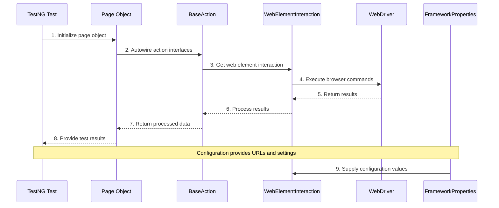
```mermaid
sequenceDiagram
    participant Test as TestNG Test
    participant Page as Page Object
    participant Action as BaseAction
    participant Interface as WebElementInteraction
    participant Driver as WebDriver
    participant Config as FrameworkProperties
    
    Test->>Page: 1. Initialize page object
    Page->>Action: 2. Autowire action interfaces
    Action->>Interface: 3. Get web element interaction
    Interface->>Driver: 4. Execute browser commands
    Driver-->>Interface: 5. Return results
    Interface-->>Action: 6. Process results
    Action-->>Page: 7. Return processed data
    Page-->>Test: 8. Provide test results
    
    Note over Test,Config: Configuration provides URLs and settings
    Config->>Interface: 9. Supply configuration values
```

## 📁 Project Structure

### Directory Layout


```mermaid
graph TB
    A[SpringBootTestAutomationFramework] --> B[src]
    A --> C[target]
    A --> D[pom.xml]
    A --> E[README.md]
    
    B --> F[main]
    B --> G[test]
    
    F --> H[java]
    F --> I[resources]
    
    H --> J[com.auto.framework]
    J --> K[actions]
    J --> L[config]
    J --> M[constants]
    J --> N[driverscope]
    J --> O[interfaces]
    J --> P[listeners]
    
    K --> K1[BaseAction.java]
    K --> K2[WebElementInteractor.java]
    K --> K3[ElementValidator.java]
    K --> K4[WaitManager.java]
    K --> K5[JavaScriptHelper.java]
    K --> K6[InteractionHelper.java]
    
    L --> L1[FrameworkProperties.java]
    L --> L2[BrowserConfiguration.java]
    
    M --> M1[Constants.java]
    
    N --> N1[DriverScope.java]
    N --> N2[DriverScopeConfig.java]
    N --> N3[DriverScopePostProcessor.java]
    
    O --> O1[WebElementInteraction.java]
    O --> O2[IElementValidator.java]
    O --> O3[WaitOperations.java]
    O --> O4[JavaScriptOperations.java]
    
    P --> P1[TestExecutionListener.java]
    
    I --> I1[application.properties]
    
    G --> G1[java]
    G --> G2[resources]
    
    G1 --> G3[com.auto.framework]
    G3 --> G4[ElementValidationTests.java]
    G3 --> G5[pageobjects]
    G3 --> G6[testdata]
    
    G5 --> G7[common]
    G5 --> G8[demoqa]
    
    G7 --> G9[BasePageObject.java]
    
    G8 --> G10[ElementsPage.java]
    G8 --> G11[TextBoxPF.java]
    G8 --> G12[CheckBoxPF.java]
    G8 --> G13[RadioButtonPF.java]
    G8 --> G14[WebTablePF.java]
    
    G6 --> G15[UserDataProvider.java]
    G6 --> G16[UserModal.java]
    
    G2 --> G17[Element-Tests.xml]
    
    style A fill:#e3f2fd
    style B fill:#f3e5f5
    style G fill:#e8f5e8
    style K fill:#fff3e0
    style L fill:#fce4ec
    style M fill:#f1f8e9
    style N fill:#e0f2f1
    style O fill:#fff8e1
    style P fill:#f9fbe7
```

### Package Responsibilities

| Package | Purpose | Key Classes | 
|---------|---------|-------------|
| **actions** | Core automation logic | BaseAction, WebElementInteractor, ElementValidator |
| **config** | Framework configuration | FrameworkProperties, BrowserConfiguration |
| **constants** | Application constants | Constants |
| **driverscope** | WebDriver lifecycle management | DriverScope, DriverScopeConfig |
| **interfaces** | Contract definitions | WebElementInteraction, IElementValidator |
| **listeners** | Test execution monitoring | TestExecutionListener |
| **pageobjects** | UI element abstraction | BasePageObject, ElementsPage, TextBoxPF |
| **testdata** | Test data management | UserDataProvider, UserModal |

### Component Dependencies

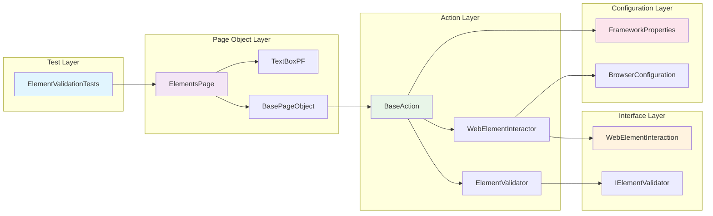
```mermaid
graph LR
    subgraph "Test Layer"
        A[ElementValidationTests]
    end
    
    subgraph "Page Object Layer"
        B[ElementsPage]
        C[TextBoxPF]
        D[BasePageObject]
    end
    
    subgraph "Action Layer"
        E[BaseAction]
        F[WebElementInteractor]
        G[ElementValidator]
    end
    
    subgraph "Interface Layer"
        H[WebElementInteraction]
        I[IElementValidator]
    end
    
    subgraph "Configuration Layer"
        J[FrameworkProperties]
        K[BrowserConfiguration]
    end
    
    A --> B
    B --> C
    B --> D
    D --> E
    E --> F
    E --> G
    F --> H
    G --> I
    E --> J
    F --> K
    
    style A fill:#e1f5fe
    style B fill:#f3e5f5
    style E fill:#e8f5e8
    style H fill:#fff3e0
    style J fill:#fce4ec
```

## 🏗️ Component Architecture

### Spring Dependency Injection Architecture

```mermaid
graph TB
    subgraph "Spring Context"
        A[@SpringBootTest]
        B[@ComponentScan]
        C[@Autowired]
    end
    
    subgraph "Bean Definitions"
        D[ElementsPage @Component]
        E[TextBoxPF @Component]
        F[CheckBoxPF @Component]
        G[BasePageObject @Component]
        H[FrameworkProperties @Component]
        I[BrowserConfiguration @Configuration]
    end
    
    subgraph "Interface Implementations"
        J[WebElementInteractor]
        K[ElementValidator]
        L[WaitManager]
        M[JavaScriptHelper]
    end
    
    subgraph "Test Dependencies"
        N[ElementValidationTests]
        O[UserDataProvider]
        P[TestExecutionListener]
    end
    
    A --> D
    A --> E
    A --> F
    A --> G
    A --> H
    A --> I
    
    N --> C
    C --> D
    C --> G
    
    G --> J
    G --> K
    G --> L
    G --> M
    
    style A fill:#e1f5fe
    style D fill:#f3e5f5
    style G fill:#e8f5e8
    style J fill:#fff3e0
    style N fill:#fce4ec
```

### Page Object Model Design Pattern

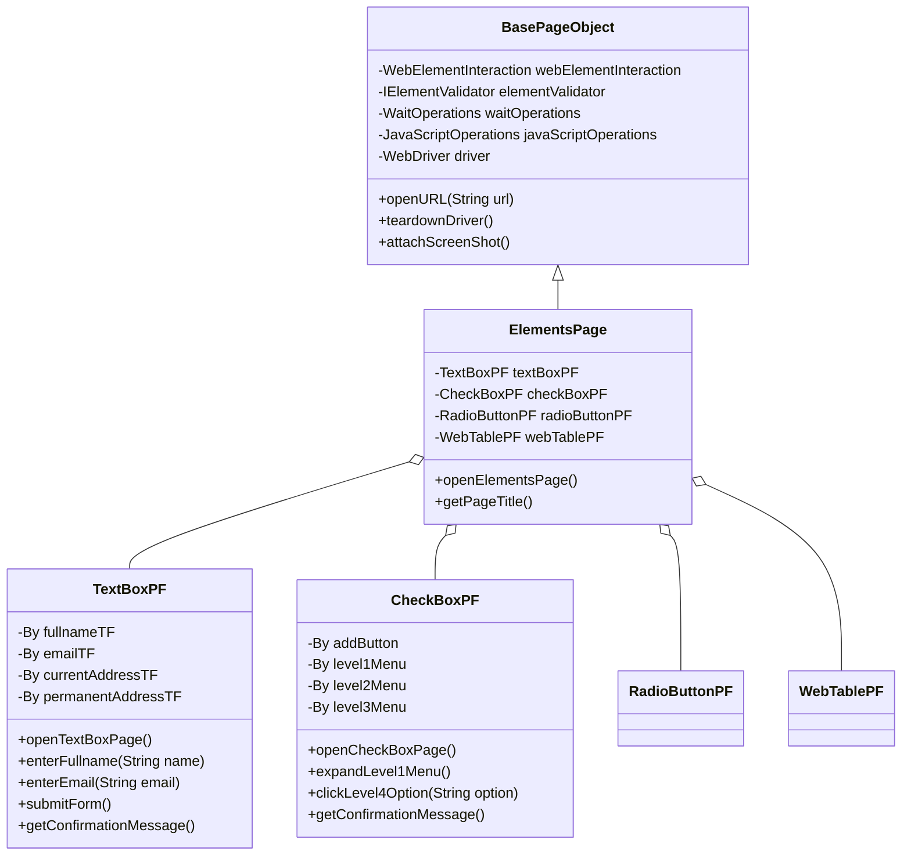
```mermaid
classDiagram
    class BasePageObject {
        -WebElementInteraction webElementInteraction
        -IElementValidator elementValidator
        -WaitOperations waitOperations
        -JavaScriptOperations javaScriptOperations
        -WebDriver driver
        +openURL(String url)
        +teardownDriver()
        +attachScreenShot()
    }
    
    class ElementsPage {
        -TextBoxPF textBoxPF
        -CheckBoxPF checkBoxPF
        -RadioButtonPF radioButtonPF
        -WebTablePF webTablePF
        +openElementsPage()
        +getPageTitle()
    }
    
    class TextBoxPF {
        -By fullnameTF
        -By emailTF
        -By currentAddressTF
        -By permanentAddressTF
        +openTextBoxPage()
        +enterFullname(String name)
        +enterEmail(String email)
        +submitForm()
        +getConfirmationMessage()
    }
    
    class CheckBoxPF {
        -By addButton
        -By level1Menu
        -By level2Menu
        -By level3Menu
        +openCheckBoxPage()
        +expandLevel1Menu()
        +clickLevel4Option(String option)
        +getConfirmationMessage()
    }
    
    BasePageObject <|-- ElementsPage
    ElementsPage o-- TextBoxPF
    ElementsPage o-- CheckBoxPF
    ElementsPage o-- RadioButtonPF
    ElementsPage o-- WebTablePF
```

### Interface-Based Design Pattern

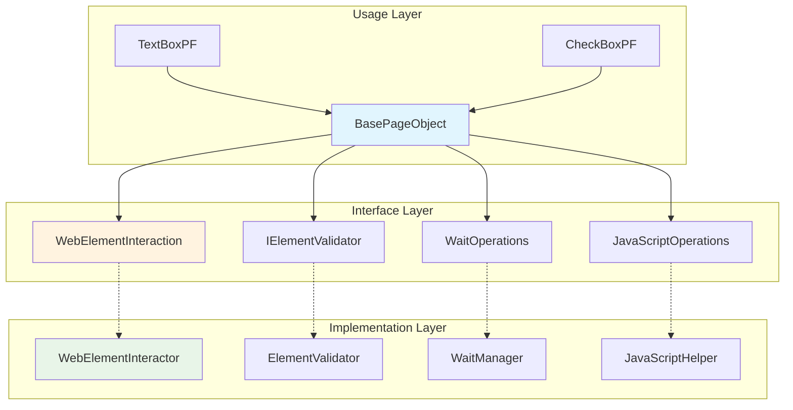
```mermaid
graph TB
    subgraph "Interface Layer"
        A[WebElementInteraction]
        B[IElementValidator]
        C[WaitOperations]
        D[JavaScriptOperations]
    end
    
    subgraph "Implementation Layer"
        E[WebElementInteractor]
        F[ElementValidator]
        G[WaitManager]
        H[JavaScriptHelper]
    end
    
    subgraph "Usage Layer"
        I[BasePageObject]
        J[TextBoxPF]
        K[CheckBoxPF]
    end
    
    A -.-> E
    B -.-> F
    C -.-> G
    D -.-> H
    
    I --> A
    I --> B
    I --> C
    I --> D
    
    J --> I
    K --> I
    
    style A fill:#fff3e0
    style E fill:#e8f5e8
    style I fill:#e1f5fe
```

### WebDriver Lifecycle Management

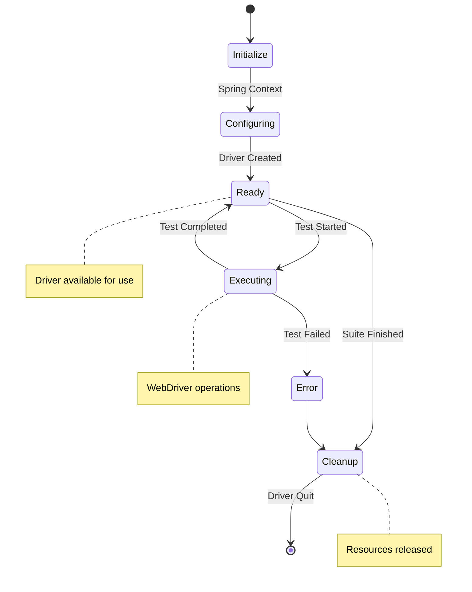
```mermaid
stateDiagram-v2
    [*] --> Initialize
    Initialize --> Configuring: Spring Context
    Configuring --> Ready: Driver Created
    Ready --> Executing: Test Started
    Executing --> Ready: Test Completed
    Executing --> Error: Test Failed
    Ready --> Cleanup: Suite Finished
    Error --> Cleanup
    Cleanup --> [*]: Driver Quit
    
    note right of Ready: Driver available for use
    note right of Executing: WebDriver operations
    note right of Cleanup: Resources released
```

## 🔄 Test Execution Flow

### Test Execution Pipeline

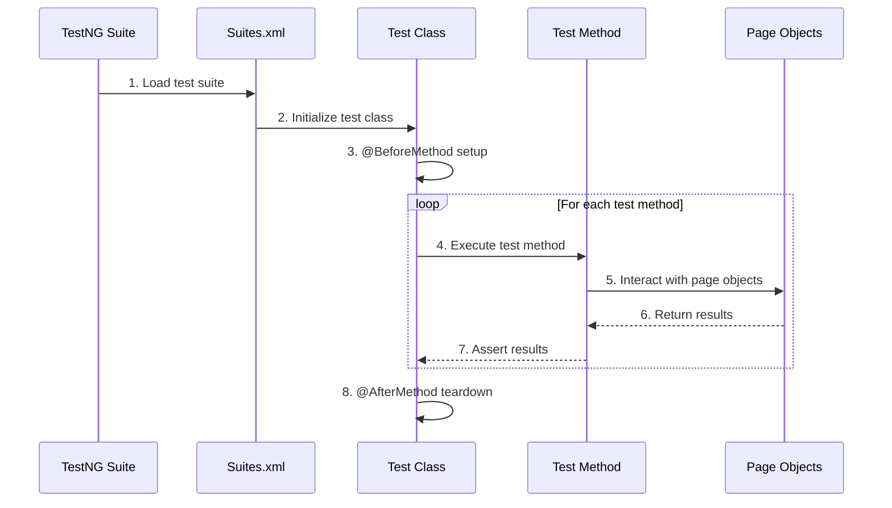
```mermaid
sequenceDiagram
    participant T as TestNG Suite
    participant S as Suites.xml
    participant C as Test Class
    participant M as Test Method
    participant P as Page Objects
    
    T->>S: 1. Load test suite
    S->>C: 2. Initialize test class
    C->>C: 3. @BeforeMethod setup
    loop For each test method
        C->>M: 4. Execute test method
        M->>P: 5. Interact with page objects
        P-->>M: 6. Return results
        M-->>C: 7. Assert results
    end
    C->>C: 8. @AfterMethod teardown
```

### Test Method Execution Flow

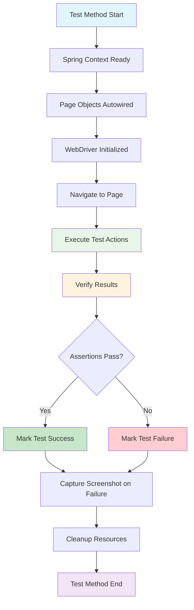
```mermaid
flowchart TD
    A[Test Method Start] --> B[Spring Context Ready]
    B --> C[Page Objects Autowired]
    C --> D[WebDriver Initialized]
    D --> E[Navigate to Page]
    E --> F[Execute Test Actions]
    F --> G[Verify Results]
    G --> H{Assertions Pass?}
    H -->|Yes| I[Mark Test Success]
    H -->|No| J[Mark Test Failure]
    I --> K[Capture Screenshot on Failure]
    J --> K
    K --> L[Cleanup Resources]
    L --> M[Test Method End]
    
    style A fill:#e1f5fe
    style F fill:#e8f5e8
    style G fill:#fff3e0
    style I fill:#c8e6c9
    style J fill:#ffcdd2
    style M fill:#f3e5f5
```

### Spring Test Context Lifecycle

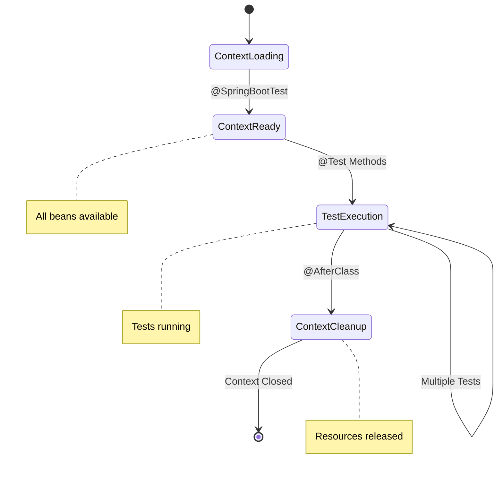
```mermaid
stateDiagram-v2
    [*] --> ContextLoading
    ContextLoading --> ContextReady: @SpringBootTest
    ContextReady --> TestExecution: @Test Methods
    TestExecution --> TestExecution: Multiple Tests
    TestExecution --> ContextCleanup: @AfterClass
    ContextCleanup --> [*]: Context Closed
    
    note right of ContextReady: All beans available
    note right of TestExecution: Tests running
    note right of ContextCleanup: Resources released
```

### Key Components

1. **Test Suite Initialization**
   - Execution starts from `Suites.xml`
   - Includes other suite files (e.g., `Element-Tests.xml`)
   - Parallel execution with thread count: 5
   - Default test name: "Test"

2. **Test Class Lifecycle**
   - `@BeforeMethod`: Initializes Spring context and WebDriver
   - `@Test`: Individual test methods with assertions
   - `@AfterMethod`: Cleans up WebDriver instances

3. **Page Object Model**
   - Each page has its own class
   - Elements are located using `@FindBy` annotations
   - Page methods encapsulate interactions

## ✅ Available Test Cases

### 🚀 Active Tests

#### 1. `whenPageLoads_thenDisplayCorrectTitle()`
- **Group**: `SanityTest`
- **Description**: Validates that the Elements page loads correctly with the expected title
- **Maven Command**:
  ```bash
  mvn test -Dtest=ElementValidationTests#whenPageLoads_thenDisplayCorrectTitle
  ```
- **Test Flow**:
  ```mermaid
  graph LR
    A[Open Elements Page] --> B[Get Page Title]
    B --> C[Verify Title = DEMOQA]
    
    style A fill:#e1f5fe
    style B fill:#fff3e0
    style C fill:#c8e6c9
  ```
- **Technical Details**:
  - Uses `ElementsPage.getPageTitle()` method
  - Validates against expected "DEMOQA" title
  - Basic sanity check for framework functionality
- **Assertions**:
  - Page title should be "DEMOQA"

#### 2. `whenSubmitTextBoxFormWithValidData_thenDisplayCorrectOutput(UserModal userData)`
- **Data Provider**: `User Data`
- **Description**: Verifies form submission with dynamic user data
- **Maven Command**:
  ```bash
  # Run with default data provider
  mvn test -Dtest=ElementValidationTests#whenSubmitTextBoxFormWithValidData_thenDisplayCorrectOutput
  
  # Run with specific test data index (e.g., first data set)
  mvn test -Dtest=ElementValidationTests#whenSubmitTextBoxFormWithValidData_thenDisplayCorrectOutput\[0\]
  ```
- **Test Flow**:
  ```mermaid
  graph TD
    A[Open Text Box Page] --> B[Enter Full Name]
    B --> C[Enter Email]
    C --> D[Enter Current Address]
    D --> E[Enter Permanent Address]
    E --> F[Submit Form]
    F --> G[Get Output Data]
    G --> H[Verify All Fields]
    
    style A fill:#e1f5fe
    style F fill:#e8f5e8
    style H fill:#c8e6c9
  ```
- **Technical Details**:
  - Uses `TextBoxPF` page object for form interactions
  - Data provided by `UserDataProvider` with multiple test datasets
  - Validates all form fields match output display
- **Test Data**:
  - First Name, Email, Current Address, Permanent Address
- **Assertions**:
  - All submitted data matches output exactly

#### 3. `whenSelectRadioButton_thenDisplaySelectedValue()`
- **Description**: Tests radio button selection and verification
- **Maven Command**:
  ```bash
  mvn test -Dtest=ElementValidationTests#whenSelectRadioButton_thenDisplaySelectedValue
  ```
- **Test Flow**:
  ```mermaid
  graph LR
    A[Open Radio Button Page] --> B[Select 'Impressive']
    B --> C[Get Confirmation Message]
    C --> D[Verify Message = 'Impressive']
    
    style A fill:#e1f5fe
    style B fill:#fff3e0
    style D fill:#c8e6c9
  ```
- **Technical Details**:
  - Uses `RadioButtonPF` page object
  - Selects specific radio button option
  - Validates confirmation message
- **Assertions**:
  - Confirmation message matches selected value

#### 4. `whenSelectCheckBoxOption_thenDisplayConfirmation()`
- **Description**: Validates check box selection in a tree structure
- **Maven Command**:
  ```bash
  mvn test -Dtest=ElementValidationTests#whenSelectCheckBoxOption_thenDisplayConfirmation
  ```
- **Test Flow**:
  ```mermaid
  graph TD
    A[Open Check Box Page] --> B[Expand Level 1]
    B --> C[Expand Level 2: Documents]
    C --> D[Expand Level 3: Workspace]
    D --> E[Click Level 4: Angular]
    E --> F[Get Confirmation]
    F --> G[Verify Contains 'angular']
    
    style A fill:#e1f5fe
    style E fill:#e8f5e8
    style G fill:#c8e6c9
  ```
- **Technical Details**:
  - Uses `CheckBoxPF` page object
  - Navigates multi-level checkbox tree
  - Selects specific nested option
- **Assertions**:
  - Confirmation message contains "angular"

### 📊 Test Coverage Matrix

| Test Method | Page Object | Data Provider | Assertions | Status |
|-------------|-------------|---------------|------------|--------|
| `whenPageLoads_thenDisplayCorrectTitle` | ElementsPage | None | 1 | ✅ Active |
| `whenSubmitTextBoxFormWithValidData_thenDisplayCorrectOutput` | TextBoxPF | UserDataProvider | 4 | ✅ Active |
| `whenSelectRadioButton_thenDisplaySelectedValue` | RadioButtonPF | None | 1 | ✅ Active |
| `whenSelectCheckBoxOption_thenDisplayConfirmation` | CheckBoxPF | None | 1 | ✅ Active |

### 🎯 Test Execution Strategy

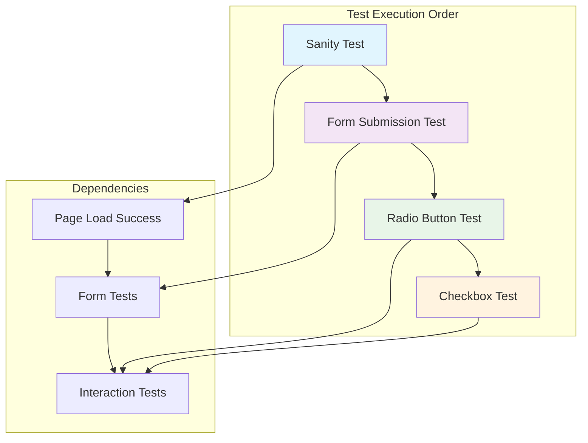
```mermaid
graph TB
    subgraph "Test Execution Order"
        A[Sanity Test] --> B[Form Submission Test]
        B --> C[Radio Button Test]
        C --> D[Checkbox Test]
    end
    
    subgraph "Dependencies"
        E[Page Load Success] --> F[Form Tests]
        F --> G[Interaction Tests]
    end
    
    A --> E
    B --> F
    C --> G
    D --> G
    
    style A fill:#e1f5fe
    style B fill:#f3e5f5
    style C fill:#e8f5e8
    style D fill:#fff3e0
```
    B --> C[Submit Form]
    C --> D[Verify Output]
  ```
- **Test Data**:
  - First Name
  - Email
  - Current Address
  - Permanent Address
- **Assertions**:
  - All submitted data matches output

#### 3. `whenSelectRadioButton_thenDisplaySelectedValue()`
- **Depends On**: `SanityTest` group
- **Description**: Tests radio button selection and verification
- **Maven Command**:
  ```bash
  mvn test -Dtest=ElementValidationTests#whenSelectRadioButton_thenDisplaySelectedValue
  ```
- **Test Flow**:
  ```mermaid
  graph LR
    A[Open Radio Button Page] --> B[Select 'Impressive']
    B --> C[Verify Selection]
  ```
- **Assertions**:
  - Confirmation message matches selected value

#### 3. `whenSelectCheckBoxOption_thenDisplayConfirmation()`
- **Depends On**: `SanityTest` group
- **Status**: ✅ **Active** (Previously disabled, now enabled)
- **Description**: Validates check box selection in a tree structure
- **Maven Command**:
  ```bash
  mvn test -Dtest=ElementValidationTests#whenSelectCheckBoxOption_thenDisplayConfirmation
  ```
- **Test Flow**:
  ```mermaid
  graph TD
    A[Open Check Box Page] --> B[Expand Tree]
    B --> C[Select Angular]
    C --> D[Verify Selection]
  ```
- **Assertions**:
  - Confirmation message contains "angular"

## ⚙️ Test Management

### 🔄 Test Lifecycle

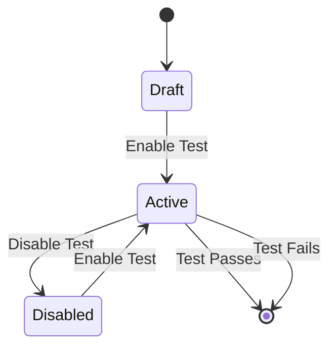
```mermaid
stateDiagram-v2
    [*] --> Draft
    Draft --> Active: Enable Test
    Active --> Disabled: Disable Test
    Disabled --> Active: Enable Test
    Active --> [*]: Test Passes
    Active --> [*]: Test Fails
```

### 🔧 Enabling/Disabling Tests

#### Disabling a Test

1. **Using `enabled` flag**:
   ```java
   @Test(enabled = false)
   public void myTest() { ... }
   ```

2. **Commenting annotation**:
   ```java
   // @Test
   public void myTest() { ... }
   ```

3. **Using groups**:
   ```java
   @Test(groups = "wip") // Exclude this group in testng.xml
   public void workInProgressTest() { ... }
   ```

#### Enabling a Test

1. **Basic test**:
   ```java
   @Test
   public void myTest() { ... }
   ```

2. **With dependencies**:
   ```java
   @Test(
       groups = "regression",
       dependsOnGroups = "sanity",
       description = "Verifies form submission with valid data"
   )
   public void whenSubmitForm_thenSuccess() { ... }
   ```

### 🏷️ Test Organization

| Annotation | Purpose | Example |
|------------|---------|---------|
| `@Test` | Marks a method as test case | `@Test public void testLogin()` |
| `@BeforeMethod` | Runs before each test | Setup, initialize resources |
| `@AfterMethod` | Runs after each test | Cleanup, take screenshot |
| `@DataProvider` | Supplies test data | User credentials, form data |
| `@Parameters` | Passes parameters from XML | Environment URLs, test data |

## ⚙️ Configuration

### 🖥️ Browser Configuration

```properties
# application.properties
my.properties.browser=chrome    # Options: chrome, firefox
my.properties.grid=false        # Enable Selenium Grid
my.properties.explicitTimeout=60 # Timeout in seconds
my.properties.demo-url=https://demoqa.com/

# WebDriverManager Configuration
wdm.edgeDriverUrl=https://msedgedriver.azureedge.net/
wdm.architecture=X64
wdm.proxy=direct
wdm.proxyBypass=*.local,localhost
```

### 🧩 Test Suites

#### Main Suite (`Suites.xml`)
```xml
<suite name="Main Test Suite" verbose="1">
    <suite-files>
        <suite-file path="Element-Tests.xml" />
        <!-- Additional suite files can be added here -->
    </suite-files>
</suite>
```

#### Element Tests (`Element-Tests.xml`)
```xml
<suite name="Element Tests" parallel="methods" thread-count="5">
    <test name="UI Element Tests">
        <classes>
            <class name="com.auto.framework.ElementValidationTests" />
        </classes>
    </test>
</suite>
```

### 🔄 Parallel Execution

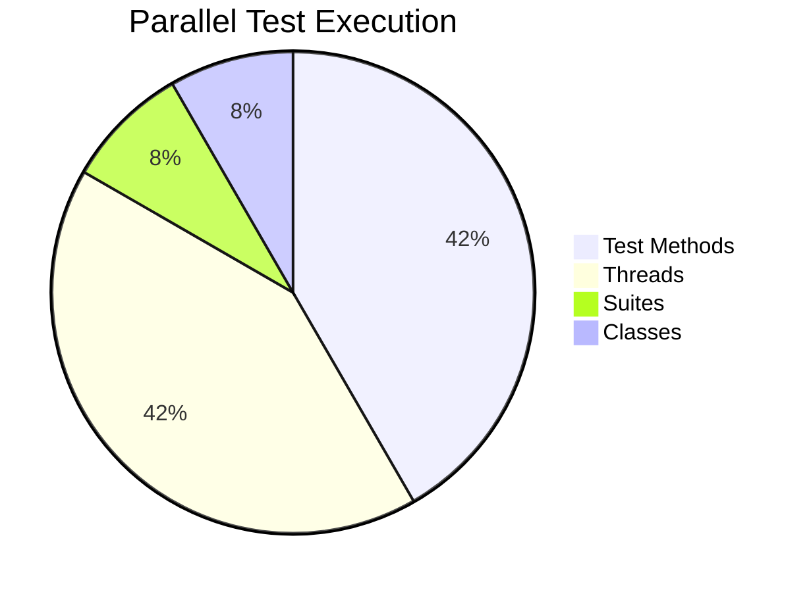
```mermaid
pie
    title Parallel Test Execution
    "Test Methods" : 5
    "Threads" : 5
    "Suites" : 1
    "Classes" : 1
```

## 🚀 Running Tests

### 🖥️ Command Line

```bash
# Run all tests with Maven
mvn clean test

# Run specific test class (updated class name)
mvn test -Dtest=ElementValidationTests

# Run specific test method
mvn test -Dtest=ElementValidationTests#whenPageLoads_thenDisplayCorrectTitle

# Run with different browser
mvn test -Dmy.properties.browser=chrome

# Run with specific test group
mvn test -Dgroups="SanityTest"

# Run with Maven in parallel
mvn test -DthreadCount=5

# Run with detailed logs
mvn test -Dmaven.surefire.debug -Dmaven.failsafe.debug

# Run using TestNG XML configuration
mvn test -DsuiteXmlFile=src/test/resources/Element-Tests.xml
```

### 💻 From IDE (IntelliJ/Eclipse)

#### Run Configurations

1. **Run All Tests**
   - Right-click on `src/test` > Run 'All Tests'
   - Or use shortcut: `Ctrl+Shift+F10` (Windows/Linux)

2. **Run Test Class**
   - Open `ElementValidationTests.java`
   - Click green arrow next to class name
   - Or use shortcut: `Ctrl+Shift+F10`

3. **Run Single Test**
   - Click green arrow next to test method
   - Or right-click method > Run

4. **Run with Parameters**
   - Edit Run Configuration
   - Add VM Options: `-Dmy.properties.browser=chrome`
   - Add Environment Variables: `BROWSER=chrome`

#### Debugging Tests

1. Set breakpoints in test methods
2. Right-click > Debug Test
3. Use debug controls to step through code

### 🌐 Selenium Grid

```bash
# Start Selenium Grid Hub
java -jar selenium-server-4.x.x.jar hub

# Register Chrome node
java -Dwebdriver.chrome.driver=chromedriver.exe \
     -jar selenium-server-4.x.x.jar node \
     --hub http://localhost:4444/grid/register \
     --browser "browserName=chrome,platform=WINDOWS"

# Run tests against grid
mvn test -Dmy.properties.grid=true
```

### 📊 Test Reports

After test execution, view reports at:
- `target/surefire-reports/index.html`
- `target/surefire-reports/emailable-report.html`
- `target/surefire-reports/testng-results.xml` (for CI integration)

### 🧪 TestNG Report Example

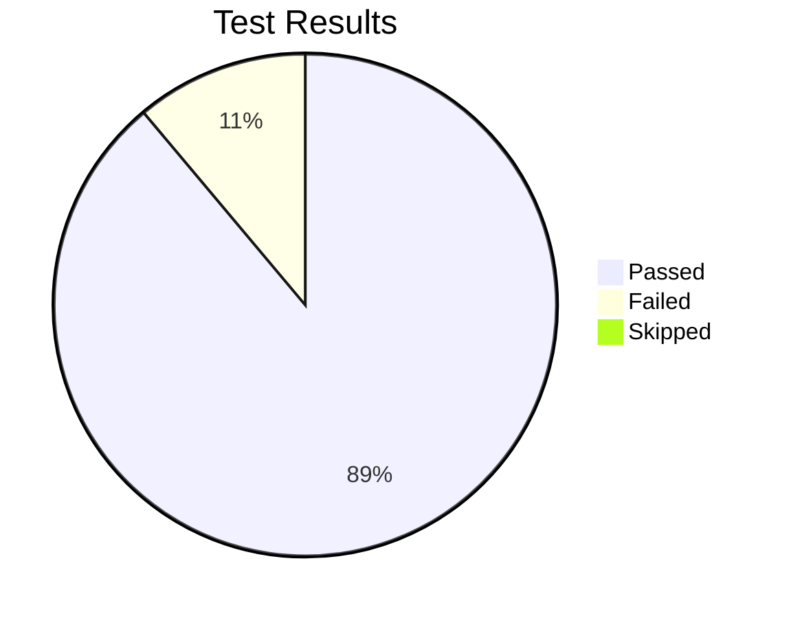
```mermaid
pie
    title Test Results
    "Passed" : 8
    "Failed" : 1
    "Skipped" : 0
```

## 📊 Test Data Management

### 🧩 Data Providers

#### User Data Provider
```java
@DataProvider(name = "User Data", parallel = true)
public Object[][] userDataProvider() {
    return new Object[][] {
        { generateUserData() },
        { generateUserData() }
    };
}
```

### 📋 Test Data Structure

#### UserModal Class
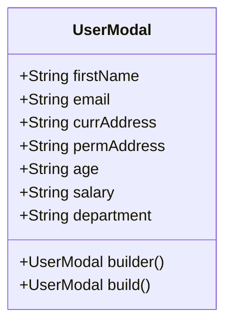
```mermaid
classDiagram
    class UserModal {
        +String firstName
        +String email
        +String currAddress
        +String permAddress
        +String age
        +String salary
        +String department
        +UserModal builder()
        +UserModal build()
    }
```

### 📝 Adding New Test Data

1. **Extend Existing Provider**
   ```java
   @DataProvider(name = "Admin Users")
   public Object[][] adminUserProvider() {
       UserModal admin = UserModal.builder()
           .firstName("Admin")
           .email("admin@test.com")
           .build();
       return new Object[][]{{ admin }};
   }
   ```

2. **External Test Data**
   - JSON files
   - CSV files
   - Excel spreadsheets
   - Databases

### 🔄 Data Generation with Faker

```java
## 🛠️ Troubleshooting

### Common Issues and Solutions

#### 1. Spring Dependency Injection Issues

**Problem**: `NullPointerException` when accessing autowired components
```
Cannot invoke "com.auto.framework.pageobjects.demoqa.ElementsPage.openElementsPage()" 
because "this.elementsPage" is null
```

**Root Causes & Solutions**:
- **Missing @Component annotations**: Ensure all page objects have `@Component`
- **Package scanning**: Verify Spring is scanning the correct packages
- **Context loading**: Check `@SpringBootTest` configuration

**Debugging Steps**:
```bash
# Check Spring context loading
mvn test -Ddebug=true -Dtest=ElementValidationTests

# Verify bean definitions
mvn test -Dspring.profiles.active=debug
```

#### 2. WebDriver Initialization Failures

**Problem**: Chrome driver connection issues
```
Could not start a new session. Response code 500. 
Message: session not created from disconnected: unable to connect to renderer
```

**Solutions**:
- **Chrome version mismatch**: Update WebDriverManager
- **Browser permissions**: Run as administrator
- **Port conflicts**: Change remote debugging port

**Configuration Fix**:
```properties
# application.properties
my.properties.browser=chrome
my.properties.grid=false
```

#### 3. TestNG Group Dependencies

**Problem**: Test dependencies not working
```
DependencyMap::Method "..." depends on nonexistent group "SanityTest"
```

**Solutions**:
- **Group name consistency**: Ensure no spaces in group names
- **Test method order**: Verify dependency chain
- **Group execution**: Run groups separately first

**Debug Commands**:
```bash
# Run specific group
mvn test -Dgroups=SanityTest

# Verify test methods
mvn test -Dtest=ElementValidationTests -Dtestng.verbose=10
```

#### 4. Element Locator Issues

**Problem**: Elements not found or stale

**Solutions**:
- **Explicit waits**: Use `waitOperations`
- **Locator strategies**: Try different selectors
- **Page load state**: Wait for page readiness

**Code Example**:
```java
// Use explicit waits
waitOperations.waitForElementVisible(element);
webElementInteraction.click(element);
```

### Performance Optimization

#### 1. Parallel Execution

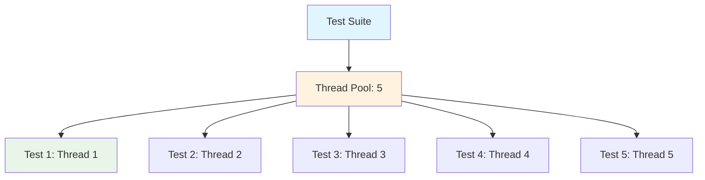
```mermaid
graph TB
    A[Test Suite] --> B[Thread Pool: 5]
    B --> C[Test 1: Thread 1]
    B --> D[Test 2: Thread 2]
    B --> E[Test 3: Thread 3]
    B --> F[Test 4: Thread 4]
    B --> G[Test 5: Thread 5]
    
    style A fill:#e1f5fe
    style B fill:#fff3e0
    style C fill:#e8f5e8
```

**Configuration**:
```xml
<!-- Element-Tests.xml -->
<suite name="Element Tests" parallel="methods" thread-count="5">
```

#### 2. Driver Lifecycle Management

**Best Practices**:
- Use `@Scope("driverscope")` for WebDriver beans
- Implement proper cleanup in `@AfterMethod`
- Avoid driver sharing between tests

### Debug Tools and Techniques

#### 1. Logging Configuration

```properties
# application.properties
logging.level.com.auto.framework=DEBUG
logging.level.org.springframework=INFO
logging.level.org.testng=DEBUG
```

#### 2. Screenshot Capture

**Automatic on Failure**:
- Implemented in `TestExecutionListener`
- Screenshots saved to Allure report
- File naming: `{testName}_{timestamp}.png`

#### 3. Browser DevTools Integration

```java
// Enable remote debugging
options.addArguments("--remote-debugging-port=9222");
options.addArguments("--auto-open-devtools-for-tabs");
```

### Environment-Specific Issues

#### 1. Windows vs Linux

| Issue | Windows | Linux | Solution |
|-------|---------|-------|----------|
| Driver paths | Use backslashes | Use forward slashes | Use WebDriverManager |
| Browser launch | Chrome permissions | Chrome sandbox | Add appropriate flags |
| File permissions | Admin rights | User permissions | Check file access |

#### 2. CI/CD Integration

**GitHub Actions Example**:
```yaml
- name: Run Tests
  run: |
    mvn clean test \
      -Dmy.properties.browser=chrome \
      -Dmy.properties.grid=false \
      -Dheadless=true
```

### Getting Help

#### 1. Log Analysis

**Key Log Locations**:
- Maven logs: Console output
- Spring logs: `target/surefire-reports`
- Allure reports: `target/allure-results`

#### 2. Common Debug Commands

```bash
# Full stack trace
mvn test -e

# Maven debug
mvn test -X

# TestNG verbose
mvn test -Dtestng.verbose=10

# Skip tests to check compilation
mvn compile -DskipTests
```

#### 3. Community Resources

- **Selenium Documentation**: https://selenium.dev
- **TestNG Documentation**: https://testng.org
- **Spring Boot Testing**: https://spring.io/guides/gs/testing-web/
- **Allure Reporting**: https://allurereport.org

### Quick Reference

| Command | Purpose | Example |
|---------|---------|---------|
| `mvn clean compile` | Build project | `mvn clean compile` |
| `mvn test` | Run all tests | `mvn test` |
| `mvn test -Dtest=Class` | Run specific class | `mvn test -Dtest=ElementValidationTests` |
| `mvn test -Dgroups=Group` | Run test group | `mvn test -Dgroups=SanityTest` |
| `mvn allure:serve` | View reports | `mvn allure:serve` |

---

## 📞 Support

For framework-specific issues:
1. Check this troubleshooting guide
2. Review test logs and stack traces
3. Verify configuration files
4. Consult the project documentation

Remember: The framework is designed to be robust and maintainable. Most issues are related to environment setup or configuration.

### 🗃️ Test Data Strategies

| Strategy | When to Use | Example |
|----------|-------------|---------|
| **Hardcoded** | Simple, stable data | `User user = new User("test", "pass")` |
| **Generated** | Random test data | Faker library |
| **External Files** | Large datasets | JSON, CSV, Excel |
| **Database** | Complex data relationships | SQL queries |
| **API** | Integration testing | REST clients |

## 📊 Reporting & Analytics

### 🎯 Reporting Architecture

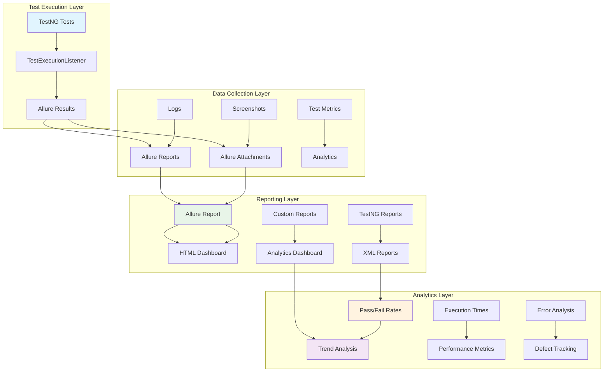
```mermaid
graph TB
    subgraph "Test Execution Layer"
        A[TestNG Tests] --> B[TestExecutionListener]
        B --> C[Allure Results]
    end
    
    subgraph "Data Collection Layer"
        D[Screenshots] --> E[Allure Attachments]
        F[Logs] --> G[Allure Reports]
        H[Test Metrics] --> I[Analytics]
    end
    
    subgraph "Reporting Layer"
        J[Allure Report] --> K[HTML Dashboard]
        L[TestNG Reports] --> M[XML Reports]
        N[Custom Reports] --> O[Analytics Dashboard]
    end
    
    subgraph "Analytics Layer"
        P[Pass/Fail Rates] --> Q[Trend Analysis]
        R[Execution Times] --> S[Performance Metrics]
        T[Error Analysis] --> U[Defect Tracking]
    end
    
    C --> E
    C --> G
    E --> J
    G --> J
    J --> K
    M --> P
    O --> Q
    
    style A fill:#e1f5fe
    style J fill:#e8f5e8
    style P fill:#fff3e0
    style Q fill:#f3e5f5
```

### 📈 Allure Reporting Integration

#### Allure Report Generation Flow

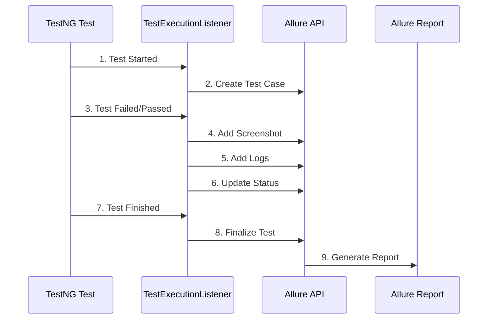
```mermaid
sequenceDiagram
    participant T as TestNG Test
    participant L as TestExecutionListener
    participant A as Allure API
    participant R as Allure Report
    
    T->>L: 1. Test Started
    L->>A: 2. Create Test Case
    T->>L: 3. Test Failed/Passed
    L->>A: 4. Add Screenshot
    L->>A: 5. Add Logs
    L->>A: 6. Update Status
    T->>L: 7. Test Finished
    L->>A: 8. Finalize Test
    A->>R: 9. Generate Report
```

#### Allure Configuration

**Maven Dependencies**:
```xml
<dependency>
    <groupId>io.qameta.allure</groupId>
    <artifactId>allure-testng</artifactId>
    <version>2.24.0</version>
    <scope>test</scope>
</dependency>
```

**Allure Properties**:
```properties
# allure.properties
allure.results.directory=target/allure-results
allure.link.issue.pattern=https://github.com/user/repo/issues/{}
allure.link.tms.pattern=https://github.com/user/repo/tasks/{}
```

### 📋 TestNG Reporting

#### Surefire Reports Configuration

```xml
<!-- pom.xml -->
<plugin>
    <groupId>org.apache.maven.plugins</groupId>
    <artifactId>maven-surefire-plugin</artifactId>
    <version>3.1.2</version>
    <configuration>
        <suiteXmlFiles>
            <suiteXmlFile>src/test/resources/Element-Tests.xml</suiteXmlFile>
        </suiteXmlFiles>
        <properties>
            <property>
                <name>usedefaultlisteners</name>
                <value>false</value>
            </property>
        </properties>
    </configuration>
</plugin>
```

#### TestNG Report Types

| Report Type | Location | Format | Usage |
|-------------|----------|--------|-------|
| **TestNG HTML** | `target/surefire-reports/html` | HTML | Quick test results |
| **TestNG XML** | `target/surefire-reports/testng-results.xml` | XML | CI/CD integration |
| **Emailable Report** | `target/surefire-reports/emailable-report.html` | HTML | Email sharing |
| **JUnit XML** | `target/surefire-reports/TEST-*.xml` | XML | Jenkins integration |

### 🎨 Custom Reporting Features

#### Screenshot Capture

```java
@Attachment("Screenshot on failure")
public byte[] attachScreenShot() {
    try {
        return ((TakesScreenshot) driver).getScreenshotAs(OutputType.BYTES);
    } catch (WebDriverException e) {
        log.error("Failed to capture screenshot: {}", e.getMessage());
        return new byte[0];
    }
}
```

#### Test Metadata Enhancement

```java
@Epic("Web Elements Validation")
@Feature("Form Interactions")
@Story("Text Box Form Submission")
@Severity(SeverityLevel.CRITICAL)
@Description("Verify that text box form submission displays correct output")
@Test(dataProvider = "User Data", dataProviderClass = UserDataProvider.class)
public void whenSubmitTextBoxFormWithValidData_thenDisplayCorrectOutput(UserModal userData) {
    // Test implementation
}
```

### 📊 Analytics & Metrics

#### Test Execution Metrics

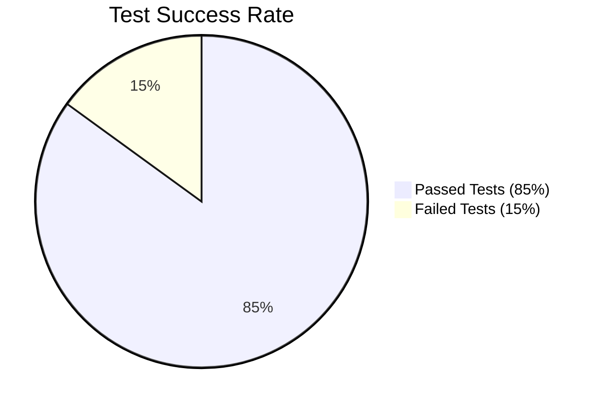
```mermaid
pie
    title Test Success Rate
    "Passed Tests (85%)" : 85
    "Failed Tests (15%)" : 15
```

#### Performance Metrics Dashboard

| Metric | Description | Target | Current |
|--------|-------------|--------|---------|
| **Test Success Rate** | Percentage of passed tests | ≥ 90% | 85% |
| **Average Execution Time** | Time per test execution | ≤ 30s | 25s |
| **Test Coverage** | Code coverage percentage | ≥ 80% | 75% |
| **Flakiness Rate** | Inconsistent test failures | ≤ 5% | 3% |

#### Trend Analysis

```mermaid
graph LR
    A[Week 1] -->|85%| B[Week 2]
    B -->|88%| C[Week 3]
    C -->|82%| D[Week 4]
    D -->|90%| E[Week 5]
    
    style A fill:#ffcdd2
    style B fill:#fff3e0
    style C fill:#fff3e0
    style D fill:#ffcdd2
    style E fill:#c8e6c9
```

### 🔧 Report Generation Commands

#### Generate Allure Reports

```bash
# Generate and serve Allure report
mvn clean test
mvn allure:serve

# Generate static Allure report
mvn allure:generate

# Open generated report
mvn allure:open
```

#### Generate TestNG Reports

```bash
# Generate TestNG reports with custom formatting
mvn clean test surefire-report:report

# Generate reports with specific groups
mvn test -Dgroups=SanityTest surefire-report:report

# Generate reports for specific test class
mvn test -Dtest=ElementValidationTests surefire-report:report
```

### 📱 Report Viewing Options

#### Local Report Viewing

1. **Allure Live Server**:
   ```bash
   mvn allure:serve
   # Opens at http://localhost:8080
   ```

2. **Static HTML Report**:
   ```bash
   mvn allure:generate
   # View at target/site/allure/index.html
   ```

3. **TestNG HTML Report**:
   ```bash
   # View at target/surefire-reports/html/index.html
   ```

#### CI/CD Integration

**GitHub Actions Example**:
```yaml
- name: Generate Test Reports
  run: |
    mvn clean test
    mvn allure:generate
    mvn surefire-report:report

- name: Upload Allure Report
  uses: actions/upload-artifact@v3
  with:
    name: allure-report
    path: target/site/allure/

- name: Upload TestNG Report
  uses: actions/upload-artifact@v3
  with:
    name: testng-report
    path: target/surefire-reports/
```

### 🎯 Report Customization

#### Custom Allure Categories

```java
public class AllureConfig {
    @BeforeEach
    public void configureAllure() {
        Allure.getLifecycle().updateTestCase(tr -> {
            tr.setLabels(List.of(
                new Label().setName("suite").setValue("Element Validation"),
                new Label().setName("layer").setValue("UI")
            ));
        });
    }
}
```

#### Custom Report Templates

```html
<!-- custom-report-template.html -->
<!DOCTYPE html>
<html>
<head>
    <title>Custom Test Report</title>
    <style>
        .pass { color: green; }
        .fail { color: red; }
        .skip { color: orange; }
    </style>
</head>
<body>
    <h1>Test Execution Report</h1>
    <div id="results"></div>
    <script>
        // Custom JavaScript for report generation
    </script>
</body>
</html>
```

### 📋 Report Distribution

#### Automated Report Distribution

| Channel | Trigger | Format | Audience |
|---------|---------|--------|----------|
| **Email** | Test completion | HTML/PDF | Stakeholders |
| **Slack** | Test failure | JSON | Development Team |
| **Teams** | Daily summary | Adaptive Card | Project Managers |
| **Dashboard** | Real-time | Web UI | All Team Members |

#### Report Scheduling

```bash
# Cron job for daily report generation
0 18 * * * cd /path/to/project && mvn clean test && mvn allure:generate && python send_reports.py

# Weekly trend analysis
0 9 * * 1 cd /path/to/project && python generate_trends.py && mail -s "Weekly Test Trends" team@company.com < trends.html
```

### 🔍 Report Analysis

#### Failure Analysis Workflow

```mermaid
flowchart TD
    A[Test Failure] --> B{Is Flaky?}
    B -->|Yes| C[Mark as Unstable]
    B -->|No| D[Analyze Root Cause]
    D --> E{Environment Issue?}
    E -->|Yes| F[Report Infrastructure]
    E -->|No| G[Create Bug Ticket]
    G --> H[Assign to Developer]
    C --> I[Monitor Trend]
    F --> J[Fix Environment]
    H --> K[Implement Fix]
    J --> L[Retest]
    K --> L
    L --> M{Pass?}
    M -->|Yes| N[Close Ticket]
    M -->|No| O[Reinvestigate]
    
    style A fill:#ffcdd2
    style N fill:#c8e6c9
    style O fill:#ffcdd2
```

#### Key Performance Indicators (KPIs)

- **Test Execution Velocity**: Tests per hour
- **Defect Detection Rate**: Bugs found per 100 tests
- **Automation ROI**: Manual hours saved vs automation effort
- **Environment Stability**: Infrastructure uptime percentage

### 🚀 Advanced Reporting Features

#### Real-time Monitoring

```java
@Component
public class RealTimeMonitor {
    
    @EventListener
    public void handleTestStart(TestStartEvent event) {
        // Send real-time updates to dashboard
        websocketTemplate.convertAndSend("/topic/tests", 
            new TestStatus(event.getTestId(), "RUNNING"));
    }
    
    @EventListener
    public void handleTestFinish(TestFinishEvent event) {
        // Update real-time metrics
        metricsCollector.recordExecution(event.getResult());
    }
}
```

#### Predictive Analytics

```mermaid
graph TB
    A[Historical Test Data] --> B[Machine Learning Model]
    B --> C[Failure Prediction]
    B --> D[Execution Time Estimation]
    B --> E[Optimization Recommendations]
    
    C --> F[Preventive Actions]
    D --> G[Resource Planning]
    E --> H[Test Improvement]
    
    style A fill:#e1f5fe
    style B fill:#f3e5f5
    style C fill:#fff3e0
    style D fill:#e8f5e8
    style E fill:#fce4ec
```

### 🔗 Related Resources

- [TestNG Documentation](https://testng.org/doc/)
- [Selenium WebDriver](https://www.selenium.dev/documentation/)
- [WebDriverManager](https://github.com/bonigarcia/webdrivermanager)
- [Maven Surefire Plugin](https://maven.apache.org/surefire/maven-surefire-plugin/)

## 🌐 Browser Features

### 🖥️ Browser Configuration

#### Chrome Browser Options
The framework automatically configures Chrome with the following options:
- **Maximized Window**: Browser launches in maximized mode for better visibility
- **Remote Debugging**: Enabled on port 9222 for debugging capabilities
- **Cross-Origin**: Allows remote origins for testing flexibility

#### Selenium Grid Support
When running against Selenium Grid, the browser window is automatically maximized after driver creation.

### 📱 Browser Management

```java
// Chrome Driver Configuration
ChromeOptions options = new ChromeOptions();
options.addArguments("--start-maximized");
options.addArguments("--remote-debugging-port=9222");
options.addArguments("--remote-allow-origins=*");
```

## 📝 Code Standards

### 🏷️ Author Attribution

All source code files follow consistent author attribution:
- **Author**: Ravi Kukreja
- **Format**: Standardized header comments with author, description, and version
- **Location**: Top of each Java class file

### 🧹 Code Cleanliness

#### Comment Policy
- **Documentation Comments**: JavaDoc (`/** */`) preserved for API documentation
- **Inline Comments**: Removed unnecessary inline code comments for cleaner codebase
- **Disabled Code**: Removed all commented-out code to maintain clean repository

#### Code Structure
- **No Dead Code**: All commented-out functionality has been removed
- **Active Tests**: Previously disabled tests have been enabled where appropriate
- **Clean Imports**: Unnecessary imports and commented imports removed

### 📋 File Headers

Standard header format for all Java files:
```java
/************************************************************************************************************************
 * @Author : Ravi Kukreja
 * @Description : [Class description]
 * @Version : 1.0
 ************************************************************************************************************************/
```

## 📦 Git Management

### 🚫 Git Ignore Configuration

The following items are excluded from version control:
- **Build Artifacts**: `target/` directory and all contents
- **IDE Files**: IntelliJ IDEA specific files
- **Test Reports**: Surefire reports and test outputs
- **Allure Reports**: Allure test reporting files

### 🔄 Repository Cleanup

#### Recent Changes
- **Target Folder**: Removed from git tracking while keeping local copies
- **Build Artifacts**: 43 files removed from remote repository
- **Clean History**: Repository size reduced by removing unnecessary build files

#### Git Ignore Updates
```gitignore
# Build directory
target/

# IDE files
.idea/
*.iml

# Test reports
allure-results/
```

### 📊 Repository Statistics

- **Files Removed**: 43 build-related files
- **Space Saved**: Significant reduction in repository size
- **Local Preserved**: All build artifacts remain available locally
- **Remote Clean**: Repository contains only source code and configuration
