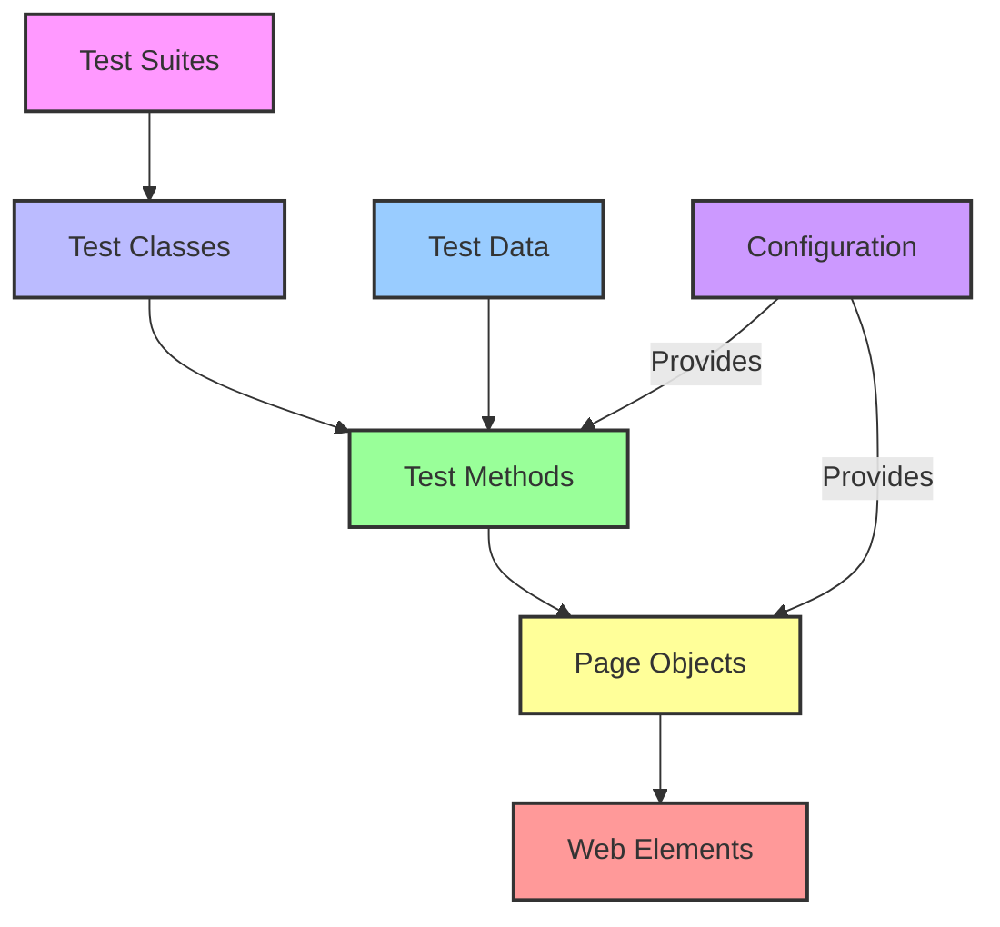
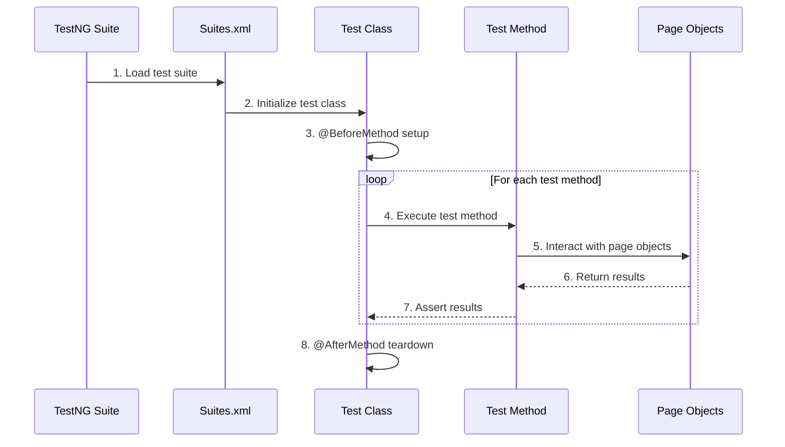
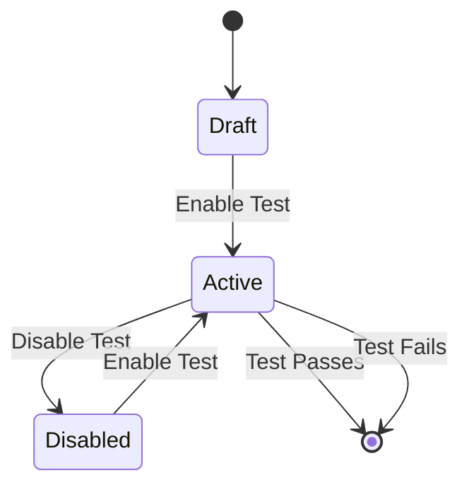
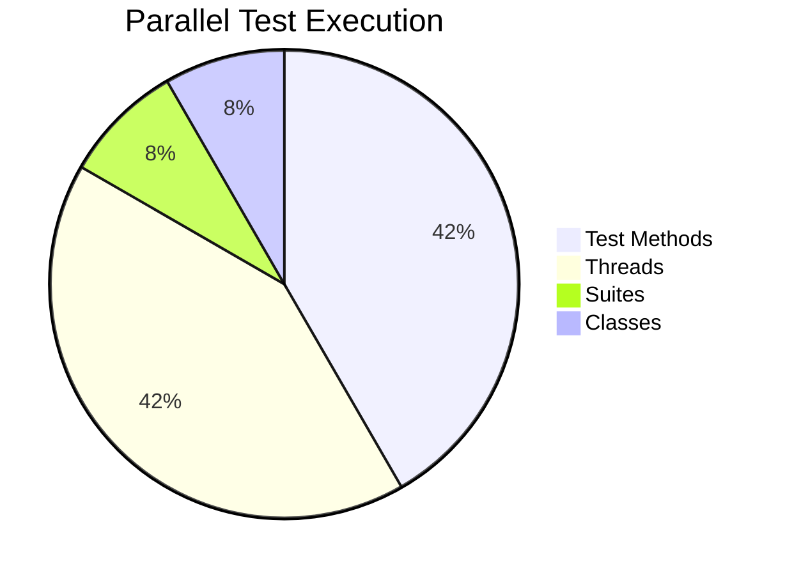
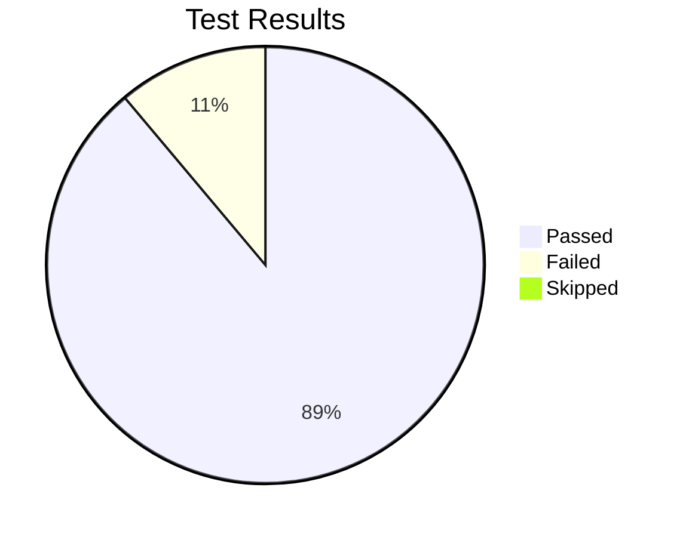
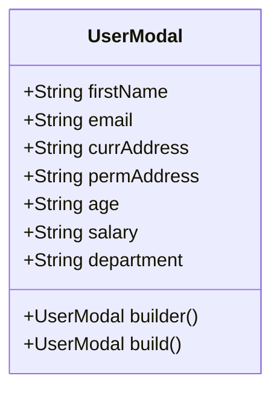

# 🧪 Test Automation Framework Documentation

> **Note**: This document provides comprehensive guidance on the test automation framework, its components, and how to work with it.

## 📋 Table of Contents
1. [Framework Overview](#-framework-overview)
2. [Recent Updates](#-recent-updates-v12)
3. [Architecture](#-architecture)
4. [Test Execution Flow](#-test-execution-flow)
5. [Available Test Cases](#-available-test-cases)
6. [Test Management](#-test-management)
7. [Configuration](#-configuration)
8. [Running Tests](#-running-tests)
9. [Test Data Management](#-test-data-management)
10. [Browser Features](#-browser-features)
11. [Code Standards](#-code-standards)
12. [Git Management](#-git-management)

## 🏗️ Framework Overview

This is a robust Selenium WebDriver based test automation framework built with modern technologies:

| Component | Technology | Purpose |
|-----------|------------|---------|
| **Core Framework** | Java 17 | Base programming language |
| **Dependency Injection** | Spring Boot 3.2.0 | Application context and bean management |
| **Testing Framework** | TestNG 7.9.0 | Test execution and reporting |
| **Browser Automation** | Selenium WebDriver 4.16.1 | Web UI automation |
| **Page Objects** | Page Factory | Web element management |
| **Driver Management** | WebDriverManager | Automated browser driver setup |
| **Build Tool** | Maven | Dependency and build management |

## 🔄 Recent Updates (v1.2)

### 📝 Class Refactoring

The framework has undergone a comprehensive class refactoring to follow modern Java conventions:

#### **Renamed Classes:**
- `ActionsBaseClass` → `BaseAction`
- `ElementVerification` → `ElementValidator`
- `ExplicitWait` → `WaitManager`
- `JavaScriptActions` → `JavaScriptHelper`
- `UIElements` → `WebElementInteractor`
- `UtilityClass` → `InteractionHelper`
- `MyProperties` → `FrameworkProperties`
- `WebDriverConfig` → `BrowserConfiguration`
- `TestListener` → `TestExecutionListener`
- `ElementTests` → `ElementValidationTests`
- `BasePage` → `BasePageObject`

#### **Interface Updates:**
- `IUIElements` → `WebElementInteraction`
- `IElementVerification` → `IElementValidator`
- `IExplicitWait` → `WaitOperations`
- `IJavaScriptActions` → `JavaScriptOperations`

#### **Impact:**
- ✅ Improved code readability and maintainability
- ✅ Consistent naming patterns throughout framework
- ✅ All Maven commands updated to use new class names
- ✅ Comprehensive JavaDoc documentation added
- ✅ Spring dependency injection properly configured

#### **Updated Test Commands:**
```bash
# Updated test class name
mvn test -Dtest=ElementValidationTests

# Updated test method
mvn test -Dtest=ElementValidationTests#whenPageLoads_thenDisplayCorrectTitle
```

## 🏛️ Architecture



## 🔄 Test Execution Flow

### Test Execution Pipeline



### Key Components

1. **Test Suite Initialization**
   - Execution starts from `Suites.xml`
   - Includes other suite files (e.g., `Element-Tests.xml`)
   - Parallel execution with thread count: 5
   - Default test name: "Test"

2. **Test Class Lifecycle**
   - `@BeforeMethod`: Initializes Spring context and WebDriver
   - `@Test`: Individual test methods with assertions
   - `@AfterMethod`: Cleans up WebDriver instances

3. **Page Object Model**
   - Each page has its own class
   - Elements are located using `@FindBy` annotations
   - Page methods encapsulate interactions

## ✅ Available Test Cases

### 🚀 Active Tests

#### 1. `whenPageLoads_thenDisplayCorrectTitle()`
- **Group**: `SanityTest`
- **Description**: Validates that the Elements page loads correctly with the expected title
- **Maven Command**:
  ```bash
  mvn test -Dtest=ElementValidationTests#whenPageLoads_thenDisplayCorrectTitle
  ```
- **Test Flow**:
  ```mermaid
  graph LR
    A[Open Elements Page] --> B[Get Page Title]
    B --> C[Verify Title = DEMOQA]
  ```
- **Assertions**:
  - Page title should be "DEMOQA"

#### 2. `whenSubmitTextBoxFormWithValidData_thenDisplayCorrectOutput(UserModal userData)`
- **Depends On**: `SanityTest` group
- **Data Provider**: `User Data`
- **Description**: Verifies form submission with dynamic user data
- **Maven Command**:
  ```bash
  # Run with default data provider
  mvn test -Dtest=ElementValidationTests#whenSubmitTextBoxFormWithValidData_thenDisplayCorrectOutput
  
  # Run with specific test data index (e.g., first data set)
  mvn test -Dtest=ElementValidationTests#whenSubmitTextBoxFormWithValidData_thenDisplayCorrectOutput\[0\]
  ```
- **Test Flow**:
  ```mermaid
  graph TD
    A[Open Text Box Page] --> B[Enter User Data]
    B --> C[Submit Form]
    C --> D[Verify Output]
  ```
- **Test Data**:
  - First Name
  - Email
  - Current Address
  - Permanent Address
- **Assertions**:
  - All submitted data matches output

#### 3. `whenSelectRadioButton_thenDisplaySelectedValue()`
- **Depends On**: `SanityTest` group
- **Description**: Tests radio button selection and verification
- **Maven Command**:
  ```bash
  mvn test -Dtest=ElementValidationTests#whenSelectRadioButton_thenDisplaySelectedValue
  ```
- **Test Flow**:
  ```mermaid
  graph LR
    A[Open Radio Button Page] --> B[Select 'Impressive']
    B --> C[Verify Selection]
  ```
- **Assertions**:
  - Confirmation message matches selected value

#### 3. `whenSelectCheckBoxOption_thenDisplayConfirmation()`
- **Depends On**: `SanityTest` group
- **Status**: ✅ **Active** (Previously disabled, now enabled)
- **Description**: Validates check box selection in a tree structure
- **Maven Command**:
  ```bash
  mvn test -Dtest=ElementValidationTests#whenSelectCheckBoxOption_thenDisplayConfirmation
  ```
- **Test Flow**:
  ```mermaid
  graph TD
    A[Open Check Box Page] --> B[Expand Tree]
    B --> C[Select Angular]
    C --> D[Verify Selection]
  ```
- **Assertions**:
  - Confirmation message contains "angular"

## ⚙️ Test Management

### 🔄 Test Lifecycle



### 🔧 Enabling/Disabling Tests

#### Disabling a Test

1. **Using `enabled` flag**:
   ```java
   @Test(enabled = false)
   public void myTest() { ... }
   ```

2. **Commenting annotation**:
   ```java
   // @Test
   public void myTest() { ... }
   ```

3. **Using groups**:
   ```java
   @Test(groups = "wip") // Exclude this group in testng.xml
   public void workInProgressTest() { ... }
   ```

#### Enabling a Test

1. **Basic test**:
   ```java
   @Test
   public void myTest() { ... }
   ```

2. **With dependencies**:
   ```java
   @Test(
       groups = "regression",
       dependsOnGroups = "sanity",
       description = "Verifies form submission with valid data"
   )
   public void whenSubmitForm_thenSuccess() { ... }
   ```

### 🏷️ Test Organization

| Annotation | Purpose | Example |
|------------|---------|---------|
| `@Test` | Marks a method as test case | `@Test public void testLogin()` |
| `@BeforeMethod` | Runs before each test | Setup, initialize resources |
| `@AfterMethod` | Runs after each test | Cleanup, take screenshot |
| `@DataProvider` | Supplies test data | User credentials, form data |
| `@Parameters` | Passes parameters from XML | Environment URLs, test data |

## ⚙️ Configuration

### 🖥️ Browser Configuration

```properties
# application.properties
my.properties.browser=chrome    # Options: chrome, firefox
my.properties.grid=false        # Enable Selenium Grid
my.properties.explicitTimeout=60 # Timeout in seconds
my.properties.demo-url=https://demoqa.com/

# WebDriverManager Configuration
wdm.edgeDriverUrl=https://msedgedriver.azureedge.net/
wdm.architecture=X64
wdm.proxy=direct
wdm.proxyBypass=*.local,localhost
```

### 🧩 Test Suites

#### Main Suite (`Suites.xml`)
```xml
<suite name="Main Test Suite" verbose="1">
    <suite-files>
        <suite-file path="Element-Tests.xml" />
        <!-- Additional suite files can be added here -->
    </suite-files>
</suite>
```

#### Element Tests (`Element-Tests.xml`)
```xml
<suite name="Element Tests" parallel="methods" thread-count="5">
    <test name="UI Element Tests">
        <classes>
            <class name="com.auto.framework.ElementValidationTests" />
        </classes>
    </test>
</suite>
```

### 🔄 Parallel Execution



## 🚀 Running Tests

### 🖥️ Command Line

```bash
# Run all tests with Maven
mvn clean test

# Run specific test class (updated class name)
mvn test -Dtest=ElementValidationTests

# Run specific test method
mvn test -Dtest=ElementValidationTests#whenPageLoads_thenDisplayCorrectTitle

# Run with different browser
mvn test -Dmy.properties.browser=chrome

# Run with specific test group
mvn test -Dgroups="SanityTest"

# Run with Maven in parallel
mvn test -DthreadCount=5

# Run with detailed logs
mvn test -Dmaven.surefire.debug -Dmaven.failsafe.debug

# Run using TestNG XML configuration
mvn test -DsuiteXmlFile=src/test/resources/Element-Tests.xml
```

### 💻 From IDE (IntelliJ/Eclipse)

#### Run Configurations

1. **Run All Tests**
   - Right-click on `src/test` > Run 'All Tests'
   - Or use shortcut: `Ctrl+Shift+F10` (Windows/Linux)

2. **Run Test Class**
   - Open `ElementValidationTests.java`
   - Click green arrow next to class name
   - Or use shortcut: `Ctrl+Shift+F10`

3. **Run Single Test**
   - Click green arrow next to test method
   - Or right-click method > Run

4. **Run with Parameters**
   - Edit Run Configuration
   - Add VM Options: `-Dmy.properties.browser=chrome`
   - Add Environment Variables: `BROWSER=chrome`

#### Debugging Tests

1. Set breakpoints in test methods
2. Right-click > Debug Test
3. Use debug controls to step through code

### 🌐 Selenium Grid

```bash
# Start Selenium Grid Hub
java -jar selenium-server-4.x.x.jar hub

# Register Chrome node
java -Dwebdriver.chrome.driver=chromedriver.exe \
     -jar selenium-server-4.x.x.jar node \
     --hub http://localhost:4444/grid/register \
     --browser "browserName=chrome,platform=WINDOWS"

# Run tests against grid
mvn test -Dmy.properties.grid=true
```

### 📊 Test Reports

After test execution, view reports at:
- `target/surefire-reports/index.html`
- `target/surefire-reports/emailable-report.html`
- `target/surefire-reports/testng-results.xml` (for CI integration)

### 🧪 TestNG Report Example



## 📊 Test Data Management

### 🧩 Data Providers

#### User Data Provider
```java
@DataProvider(name = "User Data", parallel = true)
public Object[][] userDataProvider() {
    return new Object[][] {
        { generateUserData() },
        { generateUserData() }
    };
}
```

### 📋 Test Data Structure

#### UserModal Class


### 📝 Adding New Test Data

1. **Extend Existing Provider**
   ```java
   @DataProvider(name = "Admin Users")
   public Object[][] adminUserProvider() {
       UserModal admin = UserModal.builder()
           .firstName("Admin")
           .email("admin@test.com")
           .build();
       return new Object[][]{{ admin }};
   }
   ```

2. **External Test Data**
   - JSON files
   - CSV files
   - Excel spreadsheets
   - Databases

### 🔄 Data Generation with Faker

```java
public UserModal generateUserData() {
    Faker faker = new Faker();
    return UserModal.builder()
        .firstName(faker.name().firstName())
        .email(faker.internet().emailAddress())
        .currAddress(faker.address().fullAddress())
        .permAddress(faker.address().fullAddress())
        .age(faker.number().digit())
        .salary(faker.number().digits(5))
        .department(faker.company().name())
        .build();
}
```

### 🗃️ Test Data Strategies

| Strategy | When to Use | Example |
|----------|-------------|---------|
| **Hardcoded** | Simple, stable data | `User user = new User("test", "pass")` |
| **Generated** | Random test data | Faker library |
| **External Files** | Large datasets | JSON, CSV, Excel |
| **Database** | Complex data relationships | SQL queries |
| **API** | Integration testing | REST clients |

### 🔗 Related Resources

- [TestNG Documentation](https://testng.org/doc/)
- [Selenium WebDriver](https://www.selenium.dev/documentation/)
- [WebDriverManager](https://github.com/bonigarcia/webdrivermanager)
- [Maven Surefire Plugin](https://maven.apache.org/surefire/maven-surefire-plugin/)

## 🌐 Browser Features

### 🖥️ Browser Configuration

#### Chrome Browser Options
The framework automatically configures Chrome with the following options:
- **Maximized Window**: Browser launches in maximized mode for better visibility
- **Remote Debugging**: Enabled on port 9222 for debugging capabilities
- **Cross-Origin**: Allows remote origins for testing flexibility

#### Selenium Grid Support
When running against Selenium Grid, the browser window is automatically maximized after driver creation.

### 📱 Browser Management

```java
// Chrome Driver Configuration
ChromeOptions options = new ChromeOptions();
options.addArguments("--start-maximized");
options.addArguments("--remote-debugging-port=9222");
options.addArguments("--remote-allow-origins=*");
```

## 📝 Code Standards

### 🏷️ Author Attribution

All source code files follow consistent author attribution:
- **Author**: Ravi Kukreja
- **Format**: Standardized header comments with author, description, and version
- **Location**: Top of each Java class file

### 🧹 Code Cleanliness

#### Comment Policy
- **Documentation Comments**: JavaDoc (`/** */`) preserved for API documentation
- **Inline Comments**: Removed unnecessary inline code comments for cleaner codebase
- **Disabled Code**: Removed all commented-out code to maintain clean repository

#### Code Structure
- **No Dead Code**: All commented-out functionality has been removed
- **Active Tests**: Previously disabled tests have been enabled where appropriate
- **Clean Imports**: Unnecessary imports and commented imports removed

### 📋 File Headers

Standard header format for all Java files:
```java
/************************************************************************************************************************
 * @Author : Ravi Kukreja
 * @Description : [Class description]
 * @Version : 1.0
 ************************************************************************************************************************/
```

## 📦 Git Management

### 🚫 Git Ignore Configuration

The following items are excluded from version control:
- **Build Artifacts**: `target/` directory and all contents
- **IDE Files**: IntelliJ IDEA specific files
- **Test Reports**: Surefire reports and test outputs
- **Allure Reports**: Allure test reporting files

### 🔄 Repository Cleanup

#### Recent Changes
- **Target Folder**: Removed from git tracking while keeping local copies
- **Build Artifacts**: 43 files removed from remote repository
- **Clean History**: Repository size reduced by removing unnecessary build files

#### Git Ignore Updates
```gitignore
# Build directory
target/

# IDE files
.idea/
*.iml

# Test reports
allure-results/
```

### 📊 Repository Statistics

- **Files Removed**: 43 build-related files
- **Space Saved**: Significant reduction in repository size
- **Local Preserved**: All build artifacts remain available locally
- **Remote Clean**: Repository contains only source code and configuration
